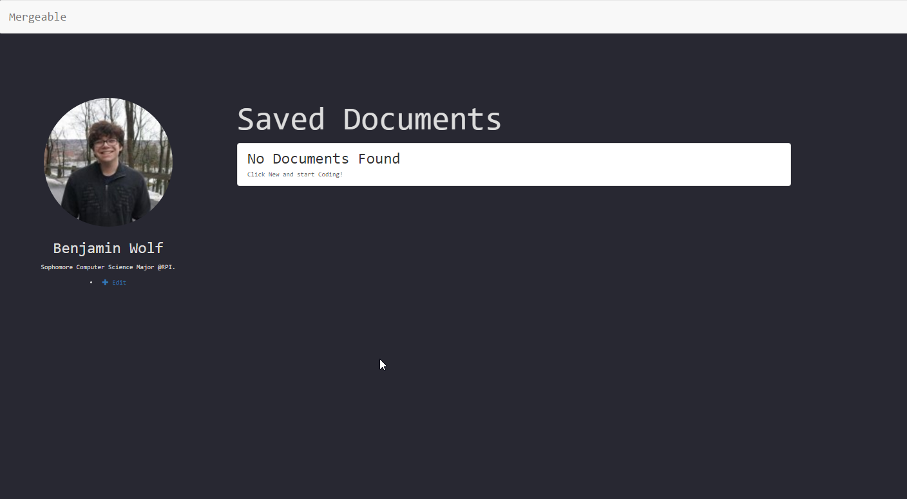
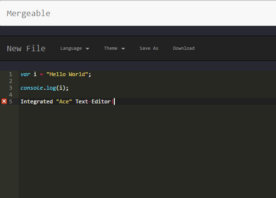

# Mergeable

Mergeable is a method of creating collaborative coding exercises that focuses on streamlining the teaching process.
Currently, our goal is to create a collaborative text-editor in which you can see updates in real time.
From there we would like to focus on creating the method of designing and implementing custom coding workshops.

## Current State

Mergeable is a website that hosts account creation and collaborative document editing through Ace's text-editor.




In order to run Mergeable locally:

  * Clone this repository.
  * Start a MongoDB instance
    * If you don't know how to do this refer to [this guide.](https://docs.mongodb.com/manual/tutorial/install-mongodb-on-windows/#run-mongodb-community-edition)
  * Run ```npm install``` while in the 'Mergeable' directory.
  * Run ```node app.js``` in the 'src' directory (inside the 'Mergeable' directory).
  * Go to http://localhost:8080 in your browser of choice.


## Goals and Milestones

### Milestone 0: Documentation - Running Milestone
* Keep this README up to date
* Update CONTRIBUTING to include our Code of Conduct
* Create documentation for how to use the website
* Keep all new code well commented and adhere to style guides
* Create [blog posts](https://rcos.io/projects/ben-wolf/mergeable/blog) whenever a big update is made

### Milestone 1: Functionality - Goal 3/20
* Run code in the browser
* Ability to download documents
* Fix existing bugs (normalize capitalization, and what is account specific/shared)
* Redesign how code is saved and updated (instead of sending entire documents on update)
* Create a design for how workshops are going to look and the creation process
* Show goals for workshop when working on a document - (hazy until design is made)

### Milestone 2: More Functionality - Goal 4/20
* Actual workshop implementation
* Restrict profile access depending on login
* Re-design the method of accessing a profile and a file (not through URL)
* Give users ability to design workshops
* Workshop grading, design and implementation
* Look into deploying, and having a running instance -- Find more issues after

### Milestone 3: Aesthetic/Design - Goal 2/25
* More freeform, design a friendly and welcoming aesthetic direction for the project
* This will require updating the HTML/CSS and JS behind all existing pages
* Change Welcome page
* Change Profile page
* Change Document page
* Establish new design principles for how we want the user to interact with the website
* Add more pages and permission functionality based on new design principles

### Milestone 4: Full Functionality and Stretch Goals 5/1+
* Clean up code architecture
* Refactor into Angular
* Deployed and user testing
* Issues based off of user testing
* Share capabilities
* Lists of public workshops for people to try


A specific list of issues filed under each respective milestone can be found [here](http://github.com/ben-wolf/mergeable/issues).
