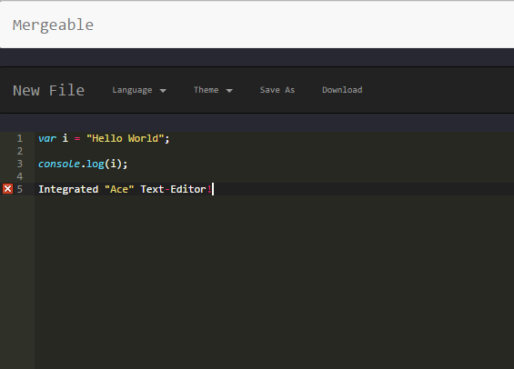

# Mergeable

Mergeable is a method of creating collaborative coding exercises that focuses on streamlining the teaching process.
Currently, our goal is to create a collaborative text-editor in which you can see updates in real time.
From there we would like to focus on creating the method of designing and implementing custom coding workshops.

## Current State

Mergeable is currently a series of webpages that host Ace's text-editor.

## Goals and Milestones

### Milestone 1 Setup - GOAL: 2/15/2017

    * Create landing page
    * Create account page
    * Create text-editor page
    * Documentation (LICENSING.md, CONTRIBUTING.md, etc…)
    * Ace integration
    * Aesthetic design/direction of website

### Milestone 2 Text-Editor/Collaboration - GOAL: 3/20/2017

    * Give users ability to choose text-editor language
    * Give users ability to choose text-editor theme
    * Allow for multiple users to view the same file (local)
    * Allow for collaborative coding
    * Allow for restrictions to be made (view/edit)

### Milestone 3 Account Management - GOAL: 4/15/2017

    * Website Interactivity/Functionality
    * Give users ability to create accounts
    * Ability to save/download/upload documents.
    * Update and manage account options
    * Move from local server

### Milestone 4 Checkpoint - Goal 5/8/2017

    * Advance collaboration to "Teacher"/"Student" permissions
    * Set a setting for files to be "workshops"
    * Provide a method for running code within a workshop
    * Provide a methods and permissions for "Teachers" to grade workshops

A specific list of issues filed under each respective milestone can be found [here](/github.com/ben-wolf/mergeable/issues).
