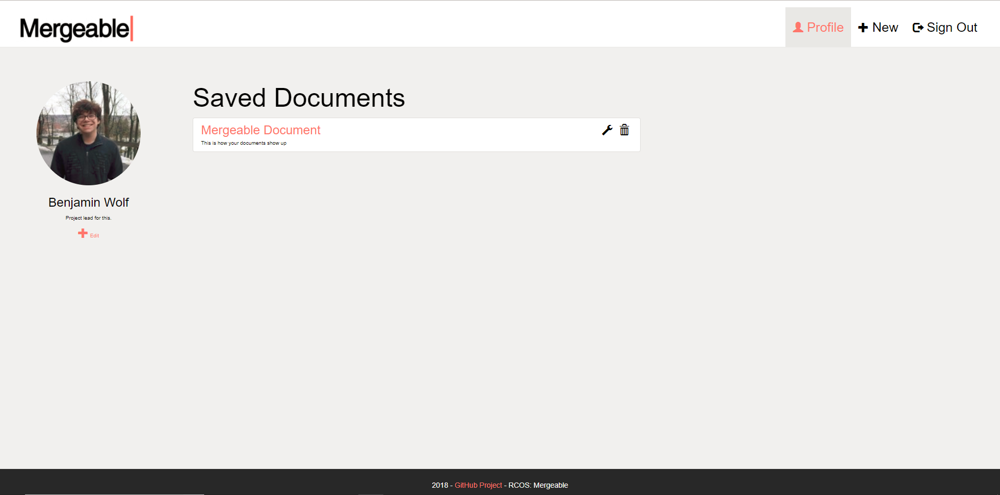

# Mergeable

Mergeable is a method of creating collaborative coding exercises that focuses on streamlining the teaching process.
Currently, our goal is to create a collaborative text-editor in which you can see updates in real time.
From there we would like to focus on creating the method of designing and implementing custom coding workshops.

## Current State

Mergeable is a website that hosts account creation and collaborative document editing through Ace's text-editor.




In order to run Mergeable locally:

  * Clone this repository.
  * Run ```npm install``` while in the 'Mergeable' directory.
  * Run ```node app.js```.
  * Go to http://localhost:8080 in your browser of choice.


## Goals and Milestones

### Milestone 1 Setup - GOAL: 2/15/2017 ✓ Completed

    * Create landing page
    * Create account page
    * Create text-editor page
    * Documentation (LICENSING.md, CONTRIBUTING.md, etc…)
    * Ace integration
    * Aesthetic design/direction of website [Ongoing]

### Milestone 2 Text-Editor/Collaboration - GOAL: 3/20/2017 ✓ Completed

    * Give users ability to choose text-editor language
    * Give users ability to choose text-editor theme
    * Allow for multiple users to view the same file (local)
    * Allow for collaborative coding
    * Allow for restrictions to be made (view/edit)

### Milestone 3 Website Interactivity/Functionality - GOAL: 4/15/2017 ✓ Completed

    * Set up database
    * Create user and document schemas
    * Account management
    * Base permissions systems for files
    * Give users ability to create accounts
    * Ability to save documents
    * Ability to update and share documents
    * Update and manage account options

### Milestone 4 Stretch Goals - Goal 5/8/2017

    * Clean up code architecture
    * Aesthetic rework
    * Provide more intuitive permissions
    * Ability to download documents
    * Ability to run code
    * Deploy to AWS
    * Create classroom style workshop tools

A specific list of issues filed under each respective milestone can be found [here](http://github.com/ben-wolf/mergeable/issues).
